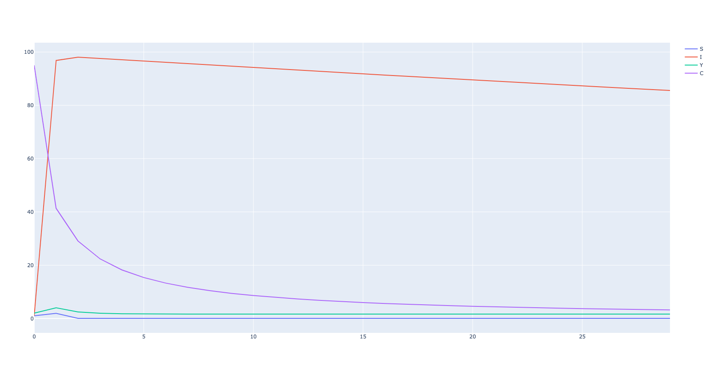

# SIYC-Simulation

## Table of Contents
- [Installation](#Installation)
  * [MacOS](#MacOS)
  * [Ubuntu](#Ubuntu)
  * [Windows](#Windows)
- [Usage](#Usage)
- [Example](#Example)
- [License](#License)

## Installation ([MacOS](#MacOS), [Ubuntu](#Ubuntu) and [Windows](#Windows))
### MacOS 

Make sure you have Python 3.7.7 and [virtualenv](https://pypi.org/project/virtualenv/) installed.

Create a new directory for this project.
```
$ mkdir new_project
$ cd new_project
```

Create an isolated environment for this project to avoid package conflicts during installation.
```
$ virtualenv venv
$ source venv/bin/activate
```

Clone this repository locally.
```
$ git clone https://github.com/dabideee13/SIYC-Simulation.git 
```

Install the necessary packages for this project.
```
$ cd SIYC-Simulation
$ pip install -r requirements.txt
```

### Ubuntu
### Windows

## Usage

In terminal:

If using default parameter values, run simulation.py.
```
$ python simulation.py
```

If not using default parameter values, input or change parameter values in the first row of input.csv then run simulation.py.
```
$ python simulation.py
```

To view current parameter settings (values), run [params.py](params.py) or open [param_values.txt](param_values.txt).
```
$ python params.py
```

## Example
```
$ python simulation.py
```
- Outputs:
  * [plot.png](plot.png)



  * Head of [simulation-data.csv](simulation-data.csv) (for default values)

|     | S                    | I                 | Y                  | C                  |
| :-: | :------------------: | :---------------: | :----------------: | :----------------: |
| 0   | 1.0                  | 1.0               | 2.0                | 95.0               |
| 1   | 1.945956768153208    | 96.84231293095348 | 3.99544253135299   | 41.34419618657036  |
| 2   | 0.050115598739517896 | 98.07187113755262 | 2.465332843965152  | 29.052268521152012 |
| 3   | 0.05006140199714214  | 97.58428163430526 | 1.9558004580579573 | 22.40408765624816  |
| 4   | 0.04974481493085033  | 97.09677935988891 | 1.7813662394312249 | 18.231140469806615 |

## License
### Code
MIT License: https://dabideee13.mit-license.org/ or see the [LICENSE](LICENSE) file.
